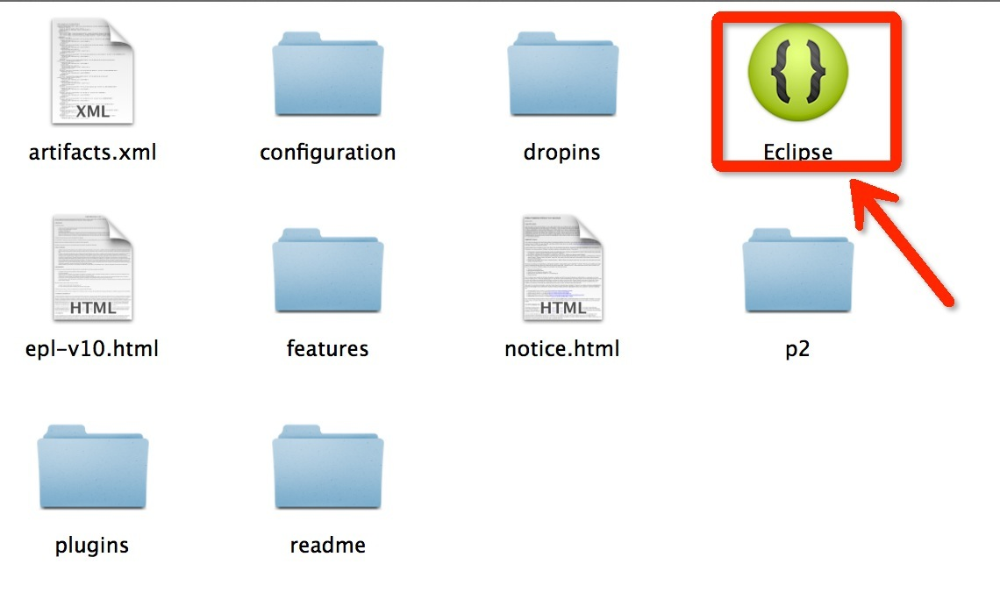
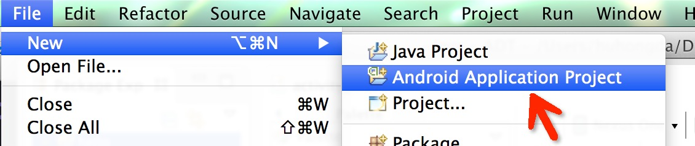

# mac 搭建Android模拟器

1, 下载模拟器，http://developer.android.com/sdk/index.html

2, 解压并查看文件

> drwxr-xr-x@ 14 huhongda  staff   476  8 22 13:40 eclipse

> drwxr-x---@ 10 huhongda  staff   340  8 22 14:31 sdk

3, 打开文件目录 

> open eclipse

4,打开后创建一个项目。

一直next => finish 就ok

5, 运行模拟器：

> 菜单栏run -> run

6, 安装现有的58share.apk

> 注：启动模拟器后才能安装成功
> sdk/platform-tools/adb install 58share.apk

参考：http://stackoverflow.com/questions/3480201/how-do-you-install-an-apk-file-in-the-android-emulator

